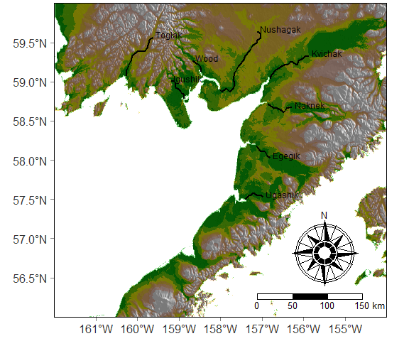

# alaska-maps

Elevations.Rmd ([rmd](https://github.com/ocean-satellite-tools/alaska-maps/blob/main/Elevations.Rmd)   [view](https://raw.githack.com/ocean-satellite-tools/alaska-maps/master/Elevations.html)) shows how to create this map using just the raster and tmap packages. All the spatial data is also from those packages. You don't need to download any extra files.

